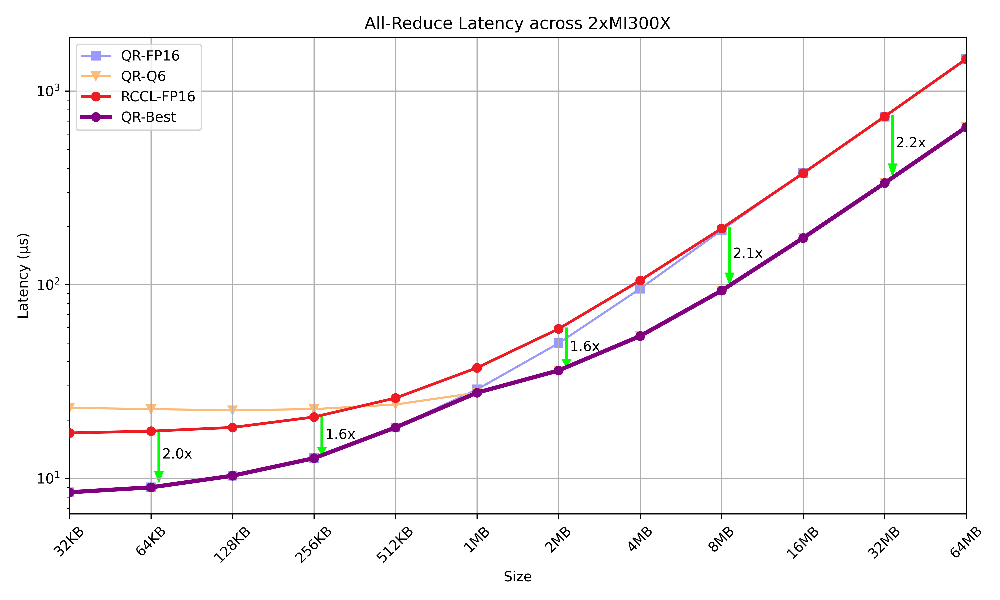
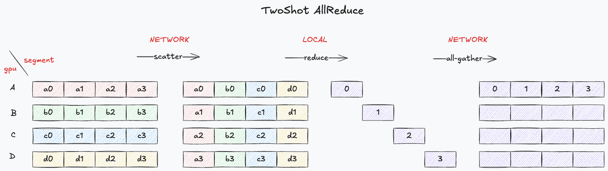

# MK1 QuickReduce

QuickReduce is a performant all-reduce library, developed by [MK1](https://mk1.ai/), designed for AMD ROCm that supports inline compression. Compared to RCCL, QuickReduce achieves up to 2.25x faster performance on 2xMI300X and 4xMI300X configurations, and outperforms RCCL for all multi-GPU (single node) configurations when tuned.

The library implements an all-reduce algorithm using hardware-optimized kernels that leverage powerful CDNA3 vector instructions for fast compression and decompression, interleaving compute with network/memory access. We expect our approach can also be ported to NVIDIA GPU architectures to improve NCCL, and leave this for further exploration.

QuickReduce implements the following line codecs:
- FP16 : Vanilla FP16 for reference.
- FP8 : FP8 quantization with block size of 32.
- Q8 : 8-bit integer quantization with block size of 32.
- Q6 : 6-bit integer quantization with block size of 32.
- Q4 : 4-bit integer quantization with block size of 32.



The above figure shows the all-reduce performance on a 2xMI300X for various FP16 workloads. We compare the optimal selection (tuning) between QR-FP16 and QR-Q6 against RCCL-FP16 showing a distinct performance improvement across all message sizes. 

QuickReduce is particularly effective for improving the [communication throughput](https://rocm.docs.amd.com/en/latest/how-to/rocm-for-ai/inference-optimization/workload.html#multi-gpu-communications) of 2 and 4 GPU MI300X deployments.

## Performance
Machine config: ROCm 6.2.41134-65d174c3e, RCCL 2.20.5+hip6.2 HEAD:d380693+, 8xMI300X on TensorWave.

Latency values are in microseconds (μs, *lower is better*). QR-FP16 shows great performance at small message sizes, and the benefits of compression (eg: QR-Q6) can be seen at the larger sizes (where the network communication footprint becomes the bottleneck). An efficient deployement will need to be tuned to select the best codec for the problem size. 

It's also important to note that inline compression may effect model fidelity and depends on many factors, such as model architecture, model size, context window size, and training / post-training techniques. While we have found negligible effects using QR-Q6, care should be taken when using lower-bit depth codecs.

#### All-Reduce Latency across 2xMI300X

| Size (B) | RCCL | QR-FP16 | QR-FP8 | QR-Q8 | QR-Q6 | QR-Q4 |
|-----:|-----:|--------:|-----------:|----------:|----------:|----------:|
| 32K | 17.15 | 8.47 | 17.74 | 20.45 | 23.13 | 20.21 |
| 64K | 17.52 | 8.98 | 18.15 | 20.34 | 22.76 | 20.93 |
| 128K | 18.31 | 10.31 | 19.13 | 21.46 | 22.46 | 21.24 |
| 256K | 20.73 | 12.70 | 18.88 | 21.18 | 22.77 | 20.88 |
| 512K | 25.97 | 18.31 | 21.61 | 23.52 | 24.05 | 22.35 |
| 1M | 37.22 | 28.78 | 27.63 | 28.46 | 27.68 | 24.01 |
| 2M | 59.14 | 49.83 | 39.28 | 39.63 | 36.05 | 29.68 |
| 4M | 105.1 | 95.29 | 62.60 | 63.31 | 54.28 | 42.23 |
| 8M | 195.2 | 191.13 | 110.70 | 115.01 | 93.22 | 70.24 |
| 16M | 376.3 | 377.52 | 213.31 | 217.37 | 174.35 | 131.06 |
| 32M | 739.0 | 737.50 | 422.33 | 423.87 | 335.08 | 249.87 |
| 64M | 1464.3 | 1463.51 | 825.55 | 829.17 | 650.92 | 468.47 |

#### All-Reduce Latency across 4xMI300X

| Size (B) | RCCL | QR-FP16 | QR-FP8 | QR-Q8 | QR-Q6 | QR-Q4 |
|-----:|-----:|--------:|-----------:|----------:|----------:|----------:|
| 32K | 18.17 | 10.59 | 20.24 | 23.29 | 23.83 | 23.23 |
| 64K | 18.23 | 11.02 | 19.92 | 23.21 | 23.47 | 23.79 |
| 128K | 29.42 | 11.95 | 20.63 | 23.89 | 24.06 | 23.57 |
| 256K | 29.98 | 12.90 | 20.78 | 24.03 | 24.47 | 23.89 |
| 512K | 32.27 | 15.60 | 22.38 | 25.53 | 26.24 | 26.15 |
| 1M | 39.40 | 21.92 | 28.14 | 28.76 | 29.18 | 29.08 |
| 2M | 48.87 | 35.60 | 40.53 | 34.77 | 33.69 | 33.57 |
| 4M | 70.61 | 66.23 | 64.03 | 54.18 | 43.84 | 40.30 |
| 8M | 115.7 | 132.53 | 128.09 | 108.27 | 76.72 | 58.12 |
| 16M | 205.4 | 239.45 | 230.78 | 222.71 | 162.61 | 113.67 |
| 32M | 388.6 | 444.78 | 414.75 | 394.30 | 303.77 | 218.10 |
| 64M | 761.2 | 831.42 | 664.54 | 640.28 | 488.78 | 374.30 |

#### All-Reduce Latency across 8xMI300X
| Size (B) | RCCL | QR-FP16 | QR-FP8 | QR-Q8 | QR-Q6 | QR-Q4 |
|-----:|-----:|--------:|-----------:|----------:|----------:|----------:|
| 32K | 16.22 | 14.81 | 24.76 | 27.51 | 28.80 | 25.79 |
| 64K | 20.00 | 15.41 | 25.52 | 28.27 | 28.54 | 27.31 |
| 128K | 22.56 | 16.15 | 25.97 | 28.91 | 28.94 | 27.47 |
| 256K | 18.01 | 16.36 | 24.95 | 28.28 | 29.00 | 27.21 |
| 512K | 24.19 | 17.26 | 25.86 | 29.71 | 30.52 | 28.85 |
| 1M | 26.39 | 20.01 | 27.64 | 32.68 | 33.60 | 31.89 |
| 2M | 34.05 | 27.90 | 32.44 | 36.40 | 37.64 | 35.43 |
| 4M | 52.13 | 46.84 | 43.85 | 44.99 | 46.98 | 43.60 |
| 8M | 83.12 | 90.34 | 85.65 | 67.73 | 64.51 | 60.08 |
| 16M | 148.4 | 147.05 | 190.61 | 157.56 | 106.20 | 82.84 |
| 32M | 240.4 | 257.34 | 330.47 | 303.94 | 227.31 | 157.92 |
| 64M | 426.0 | 463.72 | 489.94 | 481.63 | 372.07 | 272.68 |

For best results, the compression technique should be selected based on inference performance evaluated on target workloads. Our experience has shown that Q6 strikes a great balance between performance and inference fidelity across real world use cases.

## Quick start

### Requirements
- AMD Instinct CDNA3 (`gfx942`) architecture.
- ROCm 6.2 or above
- PyTorch 2.5 (ROCm) or above

### Installation
```bash
pip install ./quickreduce
```

Then, import `quickreduce` in your Python project!

### Usage

```python
import ray
import torch
import quickreduce as qr

class Demo:
    def __init__(self, world_size, rank):
        self.world_size = world_size
        self.rank = rank
        qr.init(world_size, rank)

    def get_comm_handle(self):
        return qr.get_comm_handle()

    def set_comm_handles(self, comm_handles):
        qr.set_comm_handles(comm_handles)

    def allreduce_demo(self):
        # AllReduce with profile=FP16
        # 1=FP16, 2=FP8, 3=Q8, 4=Q6, 5=Q4
        tensor = torch.ones(1024, dtype=torch.float16).cuda()
        result = qr.allreduce(1, tensor)
        assert torch.all(result == self.world_size)
        print(f"Demo {self.rank} got result {result}")

# Create 4 demo layers across 4 GPUs.
N = 4
ray.init(num_gpus=N)
demo = [ray.remote(num_gpus=1)(Demo).remote(N, i) for i in range(N)]

# Share IPC communication handles between the instances.
comm_handles = ray.get([demo[i].get_comm_handle.remote() for i in range(N)])
ray.get([demo[i].set_comm_handles.remote(comm_handles) for i in range(N)])

# Run allreduce demo.
ray.get([demo[i].allreduce_demo.remote() for i in range(N)])
```

> Note: The above demo script requires torch (ROCm) and ray

## Development
The source code is primarily in `csrc`, with the [`allreduce.h`](csrc/core/allreduce.h) containing the core algorithm and codec kernels. The following lets you build the library, run the tests, and benchmark the performance of the different compression techniques for the all-reduce.

```bash
# Create build directory
mkdir build
cd build

# Setup build
cmake .. -D CMAKE_BUILD_TYPE=Release -D CMAKE_PREFIX_PATH=/opt/rocm

# Build tests:
# - oneshot_test
# - twoshot_test
# - twoshot_q4_test
# - twoshot_q6_test
# - twoshot_q8_test
# - twoshot_fp8_test
make -j12 build_tests

# Run test (with specific world size)
mpirun -n 2 ./bin/twoshot_test

# Run benchmark
mpirun -n 2 ./bin/twoshot_test bench
```

### Design
We explored baseline all-reduce implementations commonly used for inference.

- Oneshot: Each rank directly writes its data to every other rank's communication buffer. Then, each rank reduces (adds) all contributions from other ranks (now located in its local buffer).

- Twoshot: The problem is divided into segments, and each rank is assigned a segment to reduce. A rank writes out it's data segment to the responsible target rank. Once, a rank has all the segment data it needs, it reduces them. Lastly, the ranks gather the reduced segments back to each other.



For QuickReduce, we chose the twoshot algorithm. While the oneshot algorithm was on par at smaller workloads, the twoshot algorithm had better performance at larger world sizes due to its smaller network communication footprint. Adding inline compression further improves the efficiency. Alternatively algorithms such as the ring reduce pattern would have a larger number of send/recv attempts, which in our case would accumulate error from compression. 

Another design note is that though the implementation could use less memory, we opted to take advantage of the larger memory of the MI300X for buffer management and synchronization, optimizing for maximum compute/network performance.

### Line Codecs

The quantization scheme for the line codecs are optimized for maximizing compute throughput. Though, quantization and dequantization incur overhead, they can be interleaved with the expensive network communication to boost overall performance.

The kernel is organized such that each thread works on 128B worth of data (i.e. 64 FP16 values), with each workgroup of 256 threads working on 32KB of the problem. The codec implementations use packed math instructions (eg: `v_pk_max_f16`, `v_cvt_pkrtz_f16_f32`) and intrinsics to churn through the data with as few instructions as possible. All memory accesses attempt to use the widest possible 128b/thread vector read/write with exceptions when storing quantized shards of the block data.

### Synchronization
We use `colored sempaphores` to indicate data-readiness for each rank. The kernel is launched with a specific flag color, and subsequent kernel launches use an incremented color. Whenever a rank writes out data to another rank, it sets the flag as per the configured color. Similarly, when a rank reads data from another rank, it only proceeds if the flag is set to the correct color.

This technique removes the overhead of a multi-gpu barrier to ensure all ranks have arrived at the kernel. Moreover, you never need to unset any synchronization flag, since the next kernel launch will use a different color.

## License
The code repository is licensed under the [MIT License](LICENSE).
